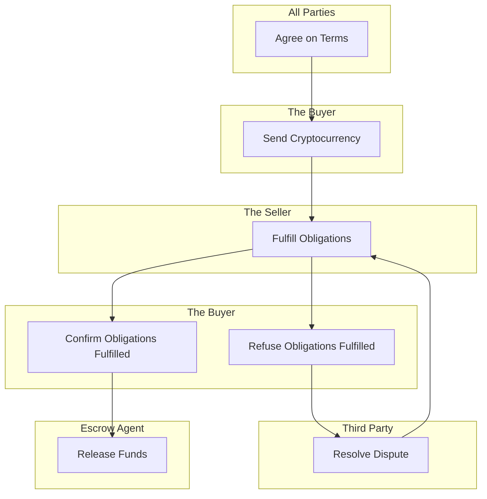

# 🔏 Crypto Escrow

[Crypto Escrow](../../resources/glossary.md#escrow) is a financial arrangement designed to enhance the security and trustworthiness of cryptocurrency transactions, often occurring between a Buyer and a Seller.&#x20;

Crypto Escrow finds common application in various cryptocurrency-related activities, including [Peer-to-peer](../../resources/glossary.md#peer-to-peer) [Swapping](../smart-contracts/automated/p2p-swap.md) or [Trading](../smart-contracts/manual/p2p-trade.md), [Initial Coin Offerings (ICOs)](../smart-contracts/automated/launchpad.md), etc. It is also the best way to secure [real-life agreements](../smart-contracts/manual/simple-agreement.md) between the mutually known Parties. It can take place from simple day-to-day occasions to [complex business agreements](../smart-contracts/custom/complex-agreement.md).

## Implementation

It operates through a step-by-step process:

1. All [Parties](../../resources/glossary.md#party) (typically a Buyer and a Seller) mutually agree on the terms of their [agreement](../../resources/glossary.md#agreement), specifying details such as prices, goals, deadlines, and any other relevant conditions.
2. [The Buyer](../../resources/glossary.md#buyer) sends the agreed-upon [assets](../../resources/glossary.md#assets) to the chosen Escrow Agent. Upon receipt of the Buyer's cryptocurrency, the Escrow Agent confirms the deposit and informs the Seller that the funds are securely held in [Escrow](../../resources/glossary.md#escrow).
3. [The Seller](../../resources/glossary.md#seller) proceeds to fulfill their obligations according to the agreed terms, which may involve delivering goods, services, or transferring [digital assets](../../resources/glossary.md#assets) to the Buyer.&#x20;
4. After receiving the goods or services, the Buyer verifies that everything is as agreed and that they are satisfied with the transaction. If any issues arise or the Buyer is dissatisfied, this results in a [dispute](../../resources/glossary.md#dispute) between Parties being opened**.**&#x20;
5. The funds remain in Escrow until the dispute is resolved or the pre-established conditions are met. This scenario usually involves the use of a [Third Party](../../resources/glossary.md#third-party), which must find a solution in a particular situation.&#x20;
6. If all Parties are content with the transaction, the Escrow Agent releases the funds to the Seller.&#x20;

### Benefits

Crypto Escrow offers several advantages:

* It removes the risk of [fraud](../../resources/glossary.md#fraud) or non-delivery. The funds are held by a trusted Third Party until all conditions are met.
* It instills confidence in all Parties that the transaction will proceed as agreed.
* In case of disputes, the Escrow Agent can mediate and ensure a fair resolution.
* Sellers are safeguarded from the risk of non-payment, while Buyers are protected from non-delivery.

### [Reputation](reputation.md)

Users have the opportunity to accumulate Reputation, which is visible to others within the Platform. This Reputation holds particular significance when participating in a [Public Escrow](anonymity.md#public-escrow), where Parties primarily rely on users' Reputation score as indicated by their basic profile. Additionally, Reputation can be leveraged to access bonuses in [staking](../smart-contracts/automated/staking.md) and [airdrops](../native-token/#airdrops), as well as to reduce [overall fees](../platform-fees.md) associated with initiating Escrow.
