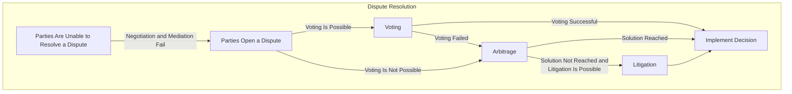

# 💬 Dispute Resolution

It's important to clarify that not all agreement disputes necessarily have a clear "right" and "wrong" Party. In many disputes, more than one Party may have legitimate concerns or grievances. The determination of right and wrong can be subjective and dependent on various factors, including legal interpretations, contractual terms, and individual perspectives.

In some cases, disputes arise due to misunderstandings or differing expectations, rather than one Party intentionally being wrong or right. In such situations, dispute resolution processes often aim to find a fair and equitable solution rather than assigning blame.

So, while it's common to try to identify which Party may be at fault in a dispute, it's essential to approach dispute resolution with the goal of reaching a mutually agreeable resolution rather than focusing solely on determining right and wrong.

## Third-Party Overview

To make dispute resolution possible, the users' agreement is introduced to the inspection of the Third Party, which must be qualified and trusted by the Parties involved.&#x20;

#### Voting

Third Party can also be used in the form of a Community Voting, which involves the independent representatives of the Platform's verified user base for casting their vote.&#x20;


[voting.md](voting.md)


#### **Arbitration**

In most cases, the role of a Third Party is performed by the Platform's Arbitration, which takes responsibility for its decisions by wagering its own reputation.


[arbitration.md](arbitration.md)


#### Litigation

Lastly, in the case of complex business agreements that include legal conditions, Litigation may be considered as a Third Party. This leads to the Parties resolving their dispute through legal channels, such as court proceedings or other forms of legal enforcement, in accordance with the terms of their contract.


[litigation.md](litigation.md)


## Implementation

If a dispute arises, one of the Parties involved (usually the Buyer or Seller) can trigger the dispute resolution process by providing evidence or making a formal dispute claim through the Platform.

A Party can provide detailed information about the dispute. This may include explaining the issue, describing what went wrong, and attaching any relevant evidence or documentation. It should be as clear and comprehensive as possible to help the Third Party understand the situation.

After the Party submits the dispute claim, the Third Party will review the case and assess the provided information. The Platform may also notify the other Parties involved in the transaction, allowing them to respond and present their side of the story.

Each Party should prepared to engage in communication with the dispute resolution authority. They may request additional information, clarification, or documentation to help them make an informed decision.

Once a resolution decision is reached, the Platform will inform all Parties of the outcome. This decision may include actions such as releasing funds, refunding assets, or taking other appropriate measures to resolve the dispute.

