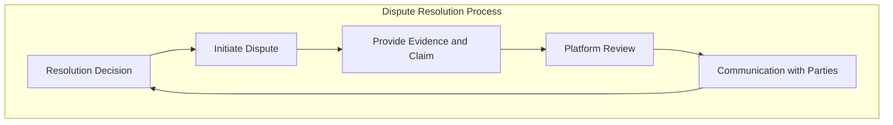

# 👔 Arbitration

The Platform's Arbitration acts as an impartial mediator, providing a neutral perspective in dispute resolution. They assess the situation objectively, considering the Terms and Conditions agreed upon by all Parties.


Arbitration is a less formal and faster alternative to [Litigation](litigation.md), which can only be used if the Parties have signed a Legal Agreement prior to Escrow creation.


## Arbitration Team

The Arbitration Team consists of individuals who are trained and experienced in conflict resolution, negotiation, and mediation. These team members play a crucial role in ensuring fair and impartial resolution of disputes that may arise during transactions.

#### **Customer Support Representatives**

These team members often act as the first point of contact for Parties involved in a dispute. They collect information, initiate the dispute resolution process, and guide users through the steps required to resolve the issue.

#### Mediators

Mediators are impartial and neutral professionals responsible for facilitating communication between the Parties in dispute. They work to help the Parties understand each other's perspectives, identify common ground, and reach a mutually acceptable resolution.

#### **Blockchain and Technology Specialists**

Blockchain-based technology experts are on the team to handle technical aspects, such as verifying transactions and ensuring the integrity of blockchain records.

#### **Compliance and Risk Management Professionals**

Ensuring that the Platform operates within regulatory frameworks and manages risks effectively is essential. Compliance and risk management experts help navigate these aspects of dispute resolution.

#### **Communication and Negotiation Specialists**

Skilled communicators and negotiators play a vital role in helping Parties find common ground, fostering productive dialogue, and working toward resolution.

#### **Record-keeping and Documentation Specialists**

Maintaining accurate records of the dispute resolution process, decisions, and outcomes is crucial. Specialists in this role ensure that records are complete and accessible when needed.

#### **Training and Quality Assurance Personnel**

Continuous training and quality assurance efforts help ensure that the dispute resolution team operates efficiently and upholds the Platform's standards of fairness and transparency.

#### **Escalation Managers**

In cases where disputes cannot be resolved through negotiation or mediation, escalation managers are responsible for initiating higher-level dispute resolution procedures, which may involve [Arbitration](voting.md) or [Litigation](litigation.md).

#### **Legal Experts**

Depending on the complexity of the dispute and the [Litigation](litigation.md) involved, the dispute resolution team may include legal experts or attorneys. They provide legal guidance and ensure that the resolution process adheres to relevant laws and regulations.

