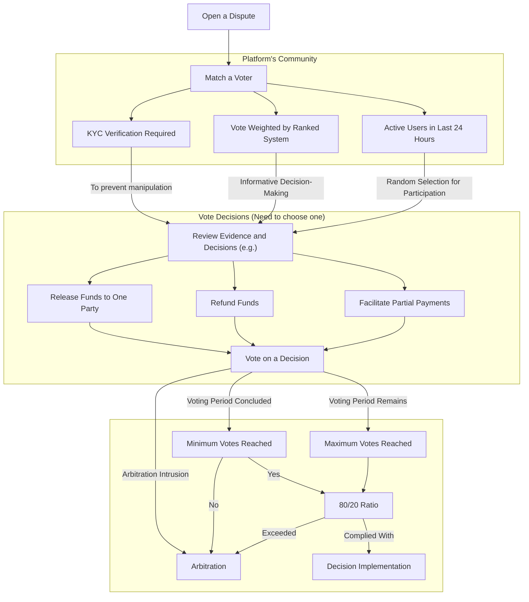

# 🗣 Voting

In cases where [disputes](../../resources/glossary.md#dispute) cannot be resolved through negotiation, the Platform provides a way to resolve them rapidly by utilizing the community. The Platform refers to a group of independent representatives from the community to participate in the [Dispute Resolution](./) process by casting their votes.


It's important to note that Voting is only a helping mechanism for addressing straightforward and transparent disputes. This approach benefits the Parties involved, as they are not required to bear the costs of [Arbitration](arbitration.md) in the event of a successful resolution. Additionally, for smaller Escrows, Voting often provides a quicker dispute resolution option, due to the Arbitration Team's prioritization for larger Escrows.


## Implementation

Each member of the community acts independently and is not influenced by external factors or affiliations. They are chosen from the Platform's user base precisely because they are not directly tied to the Parties involved in the dispute.

Users are expected to approach each dispute with impartiality and fairness. They do not have a vested interest in the outcome and must base their decisions solely on the evidence presented and the Platform's rules and guidelines.

When a dispute arises, users review all relevant evidence provided by the Parties and match it with a list of all possible solutions in the particular Escrow. This evidence may include transaction records, communication logs, and any additional documentation.

After a thorough review, each user independently votes on the resolution they believe is most appropriate for the dispute. They may choose to release funds to one party, facilitate a partial refund, or take other actions based on the merits of the case.

The voting process is transparent, with the votes and optional reasoning of each user recorded and made accessible to the Parties involved. It continues until the maximum number of votes is reached or the deadline expires.

When the voting deadline is reached, and the vote ratio exceeds [80/20](voting.md#80-20-ratio) or the minimum vote threshold is not met, the dispute is escalated to [Arbitration](arbitration.md). Otherwise, the final and binding decision is executed by updating the Escrow Smart Contract, ensuring that the resolution is implemented without the need for further intervention.

#### 80/20 Ratio

In many situations, roughly 80% of the results or effects come from 20% of the causes or inputs. it is not a strict rule but rather a general guideline to help identify areas of focus or influence. When 80% of votes or more go to one decision, it is assumed to be generally trustworthy. If the vote ratio is for example 50/50, it means the particular dispute case is not as straightforward, which requires an Arbitration Team to verify it personally.

### Prerequisites


The Parties should enable Voting as a third-party provider in [Escrow Smart Contract](../smart-contracts/) in order for it to be available.


[KYC verification](../user-registration/kyc-verification.md) is required for every user who wants to participate in Voting. This ensures that no manipulation of the user base can occur.

Secondly, only users who were active in the last **24 hours** from the moment of opening a dispute will be randomly selected to participate in dispute resolution. This will ensure faster dispute resolution.

Finally, each vote is being weighted through the [Ranked System](../crypto-escrow/reputation.md). The users with higher Reputation will have more voting impact. To ensure users' compliance with the Platform's Terms of Service, users need to build up a [Reputation](../crypto-escrow/reputation.md) to **1,500 or more points** in the Voting system before their vote will be used in the decision-making process. They can do this by placing _phantom_ votes, which will only be used for validating the user's trustworthiness in a dispute resolution.


The Escrow's assets' worth should also be **less than 1,000$** for Voting to be available. This ensures that the wrong decision picked by the majority of voters can not lead to a major asset loss for the Parties involved.


### Rewards

Users will gain [Reputation points](../crypto-escrow/reputation.md) for the votes they made only after an [Arbitration Team](arbitration.md) confirms the decision. The Arbitration Team can not possibly go through all the disputes raised on the Platform, so the [community](../../resources/glossary.md#community) can never know which disputes will be confirmed by the Platform. After the Platform's Team confirms the decision on a particular dispute, all users who voted will gain Reputation in the range **from -100 to 100 points**, dependent on the decision they made. The Voting Reputation is represented as a decimal number within **a range of 0 to 35,000 points**. It can also be a factor in [Staking APR](../smart-contracts/automated/staking.md#annual-percentage-rate).

#### [Airdrops](../native-token/)

Users become eligible to participate in Platform Airdrops after accumulating **2,000 Reputation points or more**. The distribution of rewards will be divided among active users based on their Reputation scores. Every day at **06:00 UTC**, airdrops are conducted separately for Voting and [Escrow Reputation](../crypto-escrow/reputation.md).

