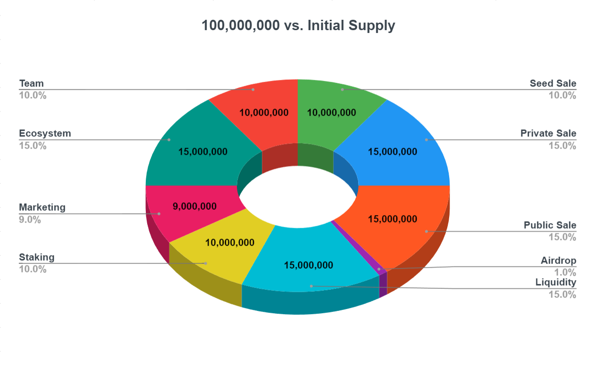
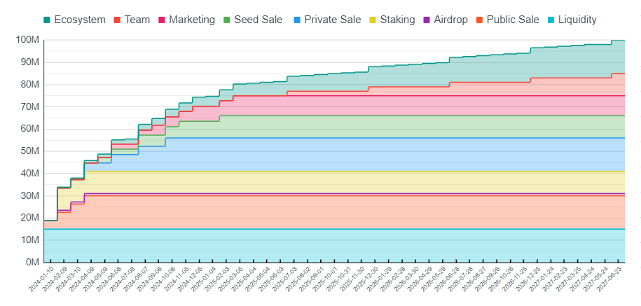

# 🪙 Tokenomics

<figure><picture><source srcset="../../.gitbook/assets/Screenshot_6.png" media="(prefers-color-scheme: dark)"></picture><figcaption></figcaption></figure>

## Summary

The total amount of the [Platform's Native Token](./) is equal to **100 million**. The Platform's Native Token has a hard-capped token supply in order to achieve decreasing inflation in the short term and deflation in the long term.

<table data-full-width="false"><thead><tr><th width="139">Allocation</th><th width="104" align="center">Amount</th><th width="115" align="center">Vesting</th><th width="106" align="center">Cliff</th><th width="115" align="center">Lockup</th><th width="110" align="center">Period</th><th width="100" data-type="checkbox">TGE</th></tr></thead><tbody><tr><td>Seed Sale</td><td align="center">10 million</td><td align="center">9 months</td><td align="center">4 months</td><td align="center">13 months</td><td align="center">quarterly</td><td>false</td></tr><tr><td>Private Sale</td><td align="center">15 million</td><td align="center">6 months</td><td align="center">3 months</td><td align="center">9 months</td><td align="center">quarterly</td><td>false</td></tr><tr><td>Public Sale</td><td align="center">15 million</td><td align="center">3 months</td><td align="center">-</td><td align="center">3 months</td><td align="center">monthly</td><td>true</td></tr><tr><td>Liquidity</td><td align="center">15 million</td><td align="center">-</td><td align="center">-</td><td align="center">-</td><td align="center">monthly</td><td>true</td></tr><tr><td>Airdrop</td><td align="center">1 million</td><td align="center">-</td><td align="center">1 month</td><td align="center">1 month</td><td align="center">monthly</td><td>false</td></tr><tr><td>Ecosystem</td><td align="center">15 million</td><td align="center">39 months</td><td align="center">1 month</td><td align="center">40 months</td><td align="center">monthly</td><td>false</td></tr><tr><td>Marketing</td><td align="center">9 million</td><td align="center">9 months</td><td align="center">5 months</td><td align="center">14 months</td><td align="center">quarterly</td><td>false</td></tr><tr><td>Staking</td><td align="center">10 million</td><td align="center">-</td><td align="center">1 month</td><td align="center">1 month</td><td align="center">monthly</td><td>false</td></tr><tr><td>Team</td><td align="center">10 million</td><td align="center">2 years</td><td align="center">1.5 years</td><td align="center">3.5 years</td><td align="center">biannually</td><td>false</td></tr></tbody></table>

### [Seed Sale](presale.md#seed-sale) - 10%

The total amount of tokens allocated for the Seed Sale is equal to **10% of the total supply (10 million tokens)**. These tokens will be vested _**quarterly**_ over a period of **9 months** with a cliff period of **4 months**, ensuring a total lock-up period of **13 months**.

### [Private Sale](presale.md#private-sale) - 15%

The total amount of tokens allocated for the Private Sale is equal to **15% of the total supply (15 million tokens)**. These tokens will be vested _**quarterly**_ over a period of **6 months** with a cliff period of **3 months**, ensuring a total lock-up period of **9 months**.

### [Public Sale](presale.md#initial-coin-offering-ico) - 15%

The total amount of tokens allocated for the Public Sale is equal to **15% of the total supply (15 million tokens)**. These tokens will be vested _**monthly**_ over a period of **3 months** with **25% of the total supply (3 million 750 thousand** **tokens)** being released at TGE.

### [Liquidity](liquidity.md) - 15%

The total amount of tokens allocated for the Liquidity is equal to **15% of the total supply (15 million tokens)**. These tokens will be **fully released** **at TGE**.

### [Airdrop](./#airdrops) - 1%

The total amount of tokens allocated for the Airdrop is equal to **1% of the total supply (1 million tokens)**. These tokens will be **fully released** after a cliff period of **1 month**.

### [Ecosystem](../user-registration/referral-system.md) - 15%

The total amount of tokens allocated for the Ecosystem equals **15% of the total supply (15 million tokens)**. These tokens will be vested _**monthly**_ over a period of **39 months** with a cliff period of 1 **month**, ensuring a total lock-up period of **40 months**.

### [Marketing](../user-registration/referral-system.md) - 9%

The total amount of tokens allocated for Marketing equals **9% of the total supply (9 million tokens)**. These tokens will be vested _**quarterly**_ over a period of **9 months** with a cliff period of **5 months**, ensuring a total lock-up period of **14 months**.

### [Staking](../smart-contracts/automated/staking.md) - 10%

The total amount of tokens allocated for Staking is equal to **10% of the total supply (10 million tokens)**. These tokens will be **fully released** after a cliff period of **1 month**.

### [Team](broken-reference) - 10%

The total amount of tokens allocated for the Team equals **10% of the total supply (10 million tokens)**. These tokens will be vested _**biannually**_ over a period of **24 months** with a cliff period of **18 months**, ensuring a total lock-up period of **42 months**.

<figure><picture><source srcset="../../.gitbook/assets/Screenshot_17.png" media="(prefers-color-scheme: dark)"></picture><figcaption></figcaption></figure>

