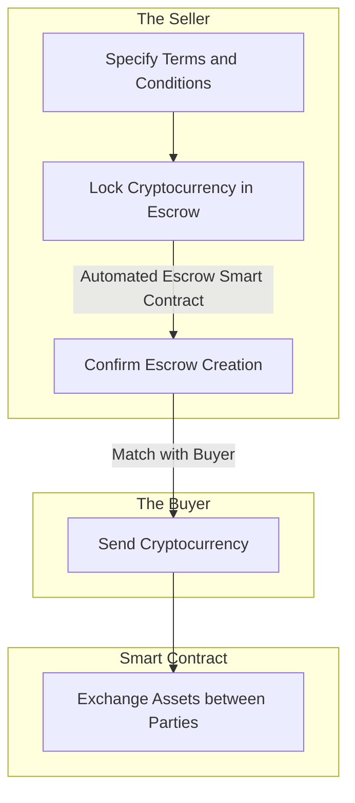

# 🔄 P2P Swap

A [peer-to-peer](../../../resources/glossary.md#peer-to-peer) (P2P) swap between two Parties involves the exchange of cryptocurrencies or tokens directly between the Parties, facilitated and secured by an [Escrow Smart Contract](../).

P2P swaps with Escrow provide an additional layer of security and trust in transactions between unfamiliar or untrusted Parties. By using an Escrow Service, users have confidence that their assets are held securely until the conditions of the swap are met. This removes the risk of fraud or the possibility of one Party failing to fulfill their end of the agreement.


The Platform does not charge any commission for initiating Automated Smart Contracts **(0% fee)**.


### Implementation

A user (the Seller) initiates the swap by supplying the amount of cryptocurrency they want to sell, the price per unit, the minimum transaction amount, and any additional terms or requirements.

Before listing, an Automated Escrow Smart Contract is created for the swap, which becomes locked with cryptocurrency for an unlimited amount of time. This Smart Contract holds the cryptocurrency being sold by the Seller securely in Escrow.

Another user (the Buyer) agrees to the Terms and Conditions set in the Escrow Smart Contract. The swap occurs automatically once the Buyer sends specified assets to the Smart Contract's address. It exchanges the assets between Parties based on the agreed-upon terms. The swap is typically simultaneous, ensuring that all Parties receive their desired assets without delay.


If the Escrow is made Public, the Seller must wait until the Buyer is matched through the Platform. Until then, the Escrow will be left open and can be cancelled by the Seller at any moment.


After the swap is executed, all Parties receive confirmation of the transaction's completion. This confirmation is recorded on the blockchain, providing transparency and an immutable record of the swap.


The dispute is not possible due to the nature of an Automated Smart Contract. The Escrow can only be cancelled manually by the Owner.


