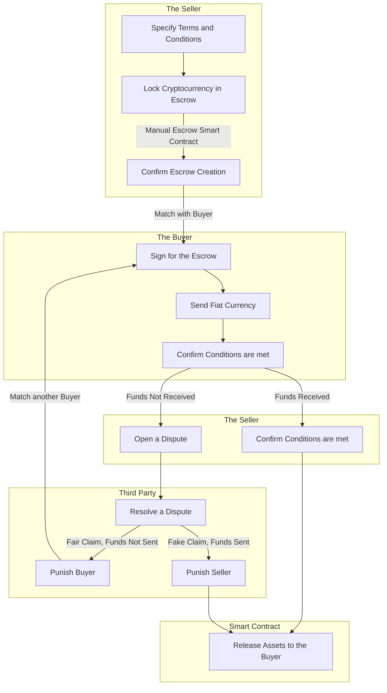

# 🤝 P2P Trade

A [peer-to-peer](../../../resources/glossary.md#peer-to-peer) (P2P) trade of fiat currency for cryptocurrencies between two Parties involves a secure and regulated environment for exchanging traditional money (such as USD, EUR, or others) for cryptocurrencies (e.g., Bitcoin, Ethereum).

Considering technical aspects, [P2P Swaps](../automated/p2p-swap.md) use Automated[ Smart Contracts](../automated/) without dispute resolution, as they're fully automated. P2P Trades, on the other hand, use [Manual Smart Contracts](./), which involve human intervention and thus include [dispute resolution](../../dispute-resolution/).


The Platform charges commission for initiating Manual Escrow Smart Contracts. Users need to pay % from the Escrow amount as well as additional fee for the [Arbitration](../../dispute-resolution/arbitration.md). More info can be found [here](../../platform-fees.md).


### Implementation

A user (the Seller) initiates the trade by supplying the amount of cryptocurrency they want to sell, the price per unit, the minimum transaction amount, accepted payment methods (e.g., bank transfer, PayPal), and any additional terms or requirements.

Before listing, a Manual Escrow Smart Contract is created for the trade. It becomes locked with cryptocurrency for an unlimited amount of time. This contract holds the cryptocurrency being sold by the Seller securely in Escrow.&#x20;

Another user (the Buyer) interested in purchasing the cryptocurrency from the Seller browses through available P2P Trade listings on the Platform and chooses a suitable offer.


If the Escrow is made Public, the Seller must wait until the Buyer is found through the Platform. Until then, the Escrow will be left open and can be cancelled by the Seller at any moment.


The Buyer signs for the Escrow by sending a transaction to the Smart Contract. After that, the Buyer initiates the payment using the agreed-upon payment method, such as a bank transfer.

After the payment is completed, the Buyer confirms the transfer on his side. When the Seller receives the fiat currency, he also confirms the transfer. Conditions of the Smart Contract are met and it transfers cryptocurrency to the Buyer's wallet.

In case of a [dispute claim](../../../resources/glossary.md#dispute) from the Seller, the [Platform's Arbitration Team](../../dispute-resolution/arbitration.md) has to be involved in order to resolve the dispute.

