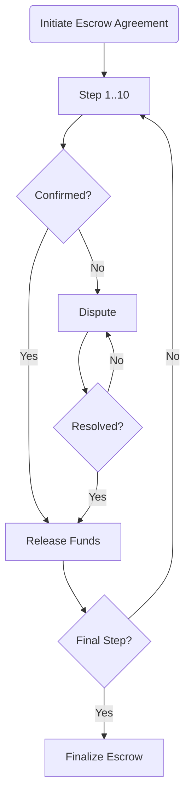

# 📄 Simple Agreement

The Platform's interface simplifies the process of creating an [Escrow](../../crypto-escrow/) for any [agreement](../../../resources/glossary.md#agreement), which culminates in a straightforward confirmation by all Parties involved.

This interface also allows users to create multi-step [Escrow](../../crypto-escrow/) with partial funds release based on completing certain conditions. This system allows for up to **10 steps**, each of which can be resolved with a [dispute claim](../../dispute-resolution/) if necessary.

#### What does multi-step mean?

For example, a user is looking to establish an Escrow arrangement for software development on a freelance basis. His proposal outlines that he will release 50% of the payment when the fundamental functionality is completed, and the remaining 50% upon achieving advanced functionality. In essence, he is setting up a multi-step Escrow with 2 separate steps.

Once Step 1 conditions are met and verified by all Parties, a predetermined portion of the funds is released to the Seller. Step 2 conditions and requirements are reviewed, and the next phase of the transaction begins. Upon successful completion of Step 2 conditions, another portion of the funds is released to the Seller.

## Implementation

The process begins when the Parties agree on the Terms and Conditions of the transaction. They are free to create a one-step or multi-step Escrow agreement.

The Platform generates a unique Escrow Smart Contract for the agreement, which is funded with the full amount of cryptocurrency to be held in Escrow.

### One-Step Escrow

The Parties fulfill their obligations, after which they mark the Escrow as completed within the Platform. The completion may require submitting evidence or documentation.

In the event of a disagreement between the Parties regarding the fulfillment of obligations, either Party has the option to initiate a dispute claim within the Platform.

Once obligations are successfully confirmed by all Parties or the dispute is resolved, the funds held in Escrow are released according to the Terms and Conditions.

### Multi-Step Escrow

The Parties define **up to 10 specific steps** or milestones that must be achieved for the release of funds. Each step should have clear and measurable criteria.

Each step is initiated in the predefined order specified within the agreement, following a sequential [One-Step Escrow](simple-agreement.md#one-step-escrow) process.

At any point in the process, if there is a disagreement or dispute between the Parties regarding the completion of a step, the process continues from the last successfully completed step.

#### Reputation

With all steps completed and funds released, the Escrow is considered finalized, and all involved Parties receive a change in their [Reputation score](../../crypto-escrow/reputation.md#escrow-reputation).

